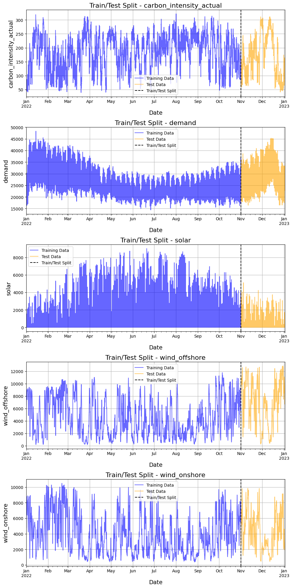
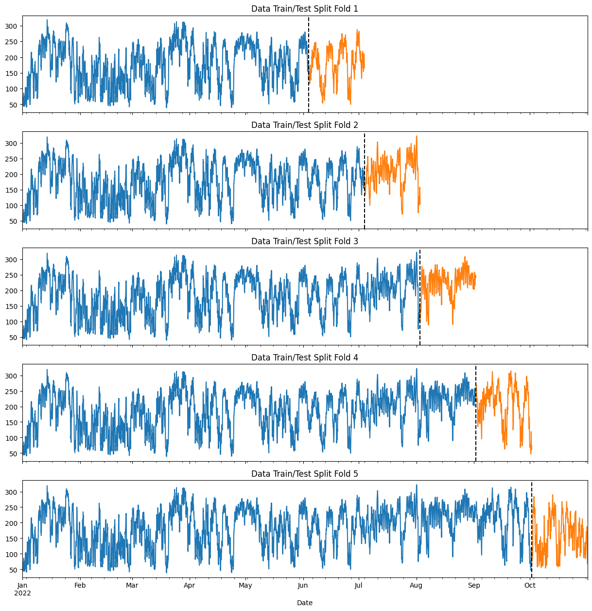
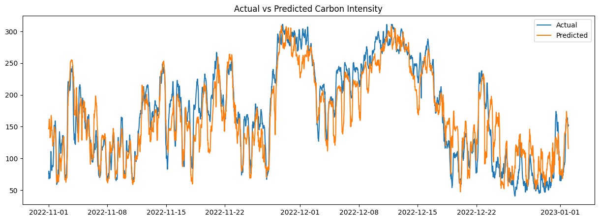
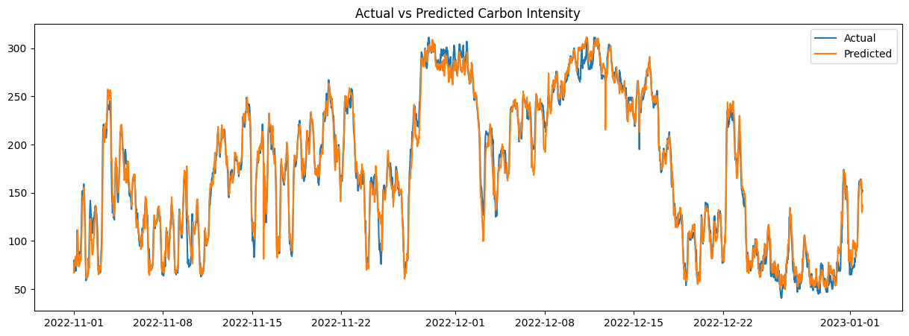

# OCF Project: Forecasting Next Day Carbon Intensity

## Task Overview

The goal of this project is to forecast the **carbon intensity** of the electricity grid for the next 24 hours in 30-minute intervals (48 predictions). The model uses previous energy demand and generation forecasts to predict future carbon intensity, contributing to better grid management, reduced carbon emissions, and greater use of renewable energy sources.

## Repository Structure

- **EDA and Modelling Notebooks**: Available in the `notebooks` directory for clarity in presenting code and results. Once finalized, the code will be moved to `.py` scripts for production.
- **Download Script**: The script for downloading generation mix data can be found in `download_generation_mix.py`.

## Forecast Features Used

- Energy demand
- Renewable energy production
- Date-time features (hour and minute)
- Lag features

## Extra Features

- **Energy Generation Mix Forecasts**: Data from the UK grid, including renewables, nuclear, and fossil fuels, sourced from [carbonintensity.org.uk](https://carbonintensity.org.uk/).

## Key Considerations

- **Stationarity and Seasonality**: The data exhibits daily and monthly patterns that affect model performance.
- **Model Generalization**: Implemented time-based cross-validation to ensure that the model generalizes well.

## Results

1. **Baseline Model** (XGBoost):
   - RMSE: 28.8 gCO₂/kWh
   - MAPE: 17.1%

2. **Improved Model** (with generation mix forecasts):
   - RMSE: 10.6 gCO₂/kWh
   - MAPE: 5.7%

## Next Steps

### More Data

- **Scale Limitation**: We trained the model with only 10 months of data. More data could lead to improved lag features, better testing, and generalization.

### Autoregressive Prediction

- **Model Exploration**: I considered using autoregressive models but was cautious about error propagation. After reviewing literature, LSTM models and large ensemble approaches are often used for such sequential data, showing better results for long-term predictions.
  
  Reference: [Ramesh Group Paper](https://groups.cs.umass.edu/ramesh/wp-content/uploads/sites/3/2022/09/buildsys2022-final282.pdf)

### Feature Engineering Improvements

- **Statistical Models**: I attempted statistical models like SARIMA, but poor results were likely due to stationarity constraints and seasonal fluctuations.
- **Additional Features**: Future plans include adding weather forecasts to incorporate external factors, which could provide valuable insights for next-day predictions.
